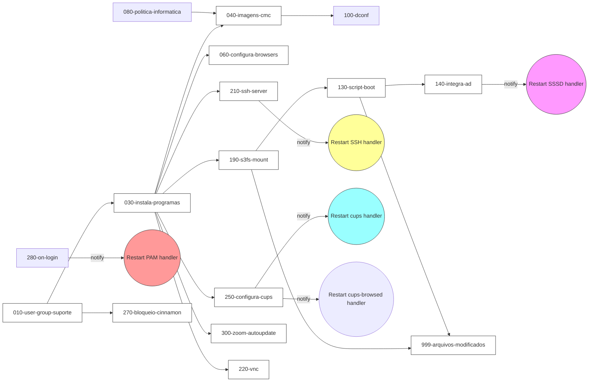

# Mapa de dependências e ordem sugerida de testes - role `estacao`

> Relatório gerado a partir da análise dos arquivos da role `roles/estacao` (tasks, handlers, vars, defaults). Contém: relações entre tasks (includes, notify → handlers, register/when), dependências de arquivos/paths e sugestão de ordem para testar tasks isoladamente.

## Observações gerais

- A execução completa segue a ordem em `tasks/main.yml` (import_tasks em sequência). Entretanto, ao testar tasks individualmente, várias têm dependências lógicas (pacotes instalados, arquivos/templates, mounts, handlers) - estas estão mapeadas abaixo.
- Relações investigadas: `import_tasks`/`include_tasks`, `register` + `when`, `notify` → `handlers`, criação de paths/arquivos usados por outras tasks, e referências a variáveis de `vars`/`defaults`.

## Handlers (efeitos colaterais acionados por notify)

Local: `roles/estacao/handlers/main.yml`

- `Restart DNS` - usado por `120-configura-dns.yml`.
- `Restart PAM` - usado por `280-on-login.yml`.
- `Restart cups` - usado por `250-configura-cups.yml`.
- `Restart cups-browsed` - usado por `250-configura-cups.yml`.
- `Restart SSSD` - usado por `140-integra-ad.yml`.
- `Restart SSH` - usado por `210-ssh-server.yml`.

Observação: Handlers são executados ao final do play, salvo quando a task executa `meta: flush_handlers` (ex.: `140-integra-ad.yml` faz `flush_handlers` para reiniciar o SSSD imediatamente).

## Diagrama de dependências (Mermaid)

Abaixo está um diagrama Mermaid mostrando as dependências críticas entre tasks e os handlers acionados por `notify`.



Legenda: setas indicam dependência lógica/execução; linhas etiquetadas `notify` mostram quais handlers serão acionados.


## Relações detectadas (por task)

- `010-user-group-suporte.yml`
  - Cria `{{ estacao_suporte_user }}` (usuário e grupo).
  - Depende(ou é referenciado) por: `210-ssh-server.yml` (AllowGroups), `270-bloqueio-cinnamon.yml` (usa `entity: "{{ estacao_suporte_user }}"`), e verificações em `molecule`.
  - Recomenda-se: testar como um dos primeiros passos (fundação).

- `020-remover-programas.yml`
  - Remove pacotes; pode interferir se rodado depois de `030-instala-programas.yml` - cuidado.

- `030-instala-programas.yml`
  - Instala pacotes essenciais (ex.: `s3fs`, browsers, `openssh-server`, `cups`, `sssd`).
  - Registra `ret` ao instalar Edge (usado localmente para `failed_when`).
  - Dependentes: praticamente todas as tasks que configuram softwares (browsers, cups, ssh, sssd, s3fs).
  - Recomenda-se: executar antes de tasks de configuração de serviços.

- `040-imagens-cmc.yml`
  - Ajusta imagens; dependência leve.
  - O que faz: copia imagens (wallpaper e login) para `/usr/share/backgrounds/cmc/` e ícones para `/usr/share/pixmaps/`.
  - Relação direta com `100-dconf.yml`: o template `templates/dconf-cmc-config.j2` (usado por `100`) define o background via `picture-uri='file://{{ estacao_wallpaper_filename }}'` — ou seja, o arquivo referenciado pelo dconf precisa existir antes de executar `dconf update`.
  - Recomenda-se: executar `040-imagens-cmc.yml` antes de `100-dconf.yml` (ou garantir que `{{ estacao_wallpaper_filename }}` exista) — especialmente se você executar tasks por tag `imagens` e esperar que a alteração seja aplicada no ambiente gráfico imediatamente.

- `050-skel.yml`
  - Cria `/etc/skel` e vários arquivos padrão (atalhos, scripts, .politicainformatica.sh etc.).
  - Pacotes do sistema podem ser necessários para alguns paths (ex.: atalhos de navegadores instalados por `030`).
  - Relação com `080-politica-informatica.yml`: o template `/etc/skel/.politicainformatica.sh` (em `templates/politicainformatica.sh.j2`) usa o arquivo `{{ estacao_politica }}` (variável `estacao_politica`) como fonte para o conteúdo da política.
  - Se `050-skel` for executado antes de `080-politica-informatica.yml`, o arquivo `{{ estacao_politica }}` pode não existir; o script em `/etc/skel` pode tocar `~/.forcelogout` em sessões de usuário caso o Zenity falhe. Por isso recomenda-se executar `080-politica-informatica.yml` antes de `050-skel.yml`, ou criar um mock do arquivo `{{ estacao_politica }}` antes de rodar `050`.

- `060-configura-browsers.yml`
  - Depende de navegadores instalados por `030`.

- `070-autostart.yml`, `080-politica-informatica.yml`, `090-desabilita-tty.yml`, `100-dconf.yml`, `110-terminal-policy.yml`
  - Geralmente independentes; escrevem arquivos que `999-arquivos-modificados.yml` referencia.

- `120-configura-dns.yml`
  - Faz alterações e notifica `Restart DNS`.

- `130-script-boot.yml`
  - Cria `{{ estacao_bootsh }}` e units systemd (`cmc-boot.service`, `cmc-boot.timer`).
  - Importante: templates/units podem referenciar `{{ estacao_mnt_suporte }}` (ex.: `cmc-network.service.j2` contém `ExecStart=/bin/bash {{ estacao_mnt_suporte }}/scripts/boot.sh`). Se o arquivo referenciado existir apenas no mount S3 (criado por `190`), o serviço poderá falhar ao iniciar.
  - Recomenda-se: testar `130` após garantir existência do script referenciado (rodar `190` primeiro ou mockar o arquivo).

- `140-integra-ad.yml`
  - Executa `{{ estacao_bootsh }}`; registra `hostname` e `ad_domain_list`.
  - Usa `when: ad_domain_list.rc != 0` para decidir o `realm join`.
  - Notifica `Restart SSSD` e chama `meta: flush_handlers` (SSSD reiniciado imediatamente).
  - Dependências: `130` (pois chama `estacao_bootsh`). Testar `140` após `130`.

- `150-configura-pam.yml` e `280-on-login.yml`
  - `280` copia `on-login.sh` para `{{ estacao_loginsh }}` e altera `/etc/pam.d/common-session`; notifica `Restart PAM`.
  - Relação: mudanças no PAM podem afetar autenticação/AD; testar `140` e `150/280` em sequência se necessário.

- `160-sudoers.yml`
  - Adiciona grupo DTIC. `210-ssh-server.yml` inclui `estacao_dtic_group` na configuração `AllowGroups` — não é obrigatório executar `160` antes de `210`, mas é coerente fazê-lo.

- `170-unattended-upgrades.yml`, `180-bashrc.yml`
  - Independentes na maior parte.

- `190-s3fs-mount.yml`
  - Cria `/etc/passwd-s3fs` (chaves), o diretório `{{ estacao_mnt_suporte }}` e adiciona entrada em `/etc/fstab` para montar o bucket S3 usando `s3fs`.
  - Impacto: provê conteúdo usado por templates/serviços (ex.: `cmc-network.service.j2`, `zoom-update.sh.j2`) e é referenciado em `999-arquivos-modificados.yml`.
  - Recomenda-se: executar `190` antes de tarefas que dependem de arquivos dentro de `{{ estacao_mnt_suporte }}`.

- `200-script-rede.yml`
  - Usa templates systemd que podem referenciar `{{ estacao_mnt_suporte }}`; relação com `190` e `130`.

- `210-ssh-server.yml`
  - Modifica `/etc/ssh/sshd_config` e `notify: Restart SSH`.
  - Depende de `030` (sshd instalado) e idealmente de `010`/`160` (consistência do grupo/usuário).

- `220-vnc.yml`, `230-menu-items.yml`, `240-login-grafico.yml`
  - Geralmente independentes; `240` altera configurações de login gráfico.

- `250-configura-cups.yml`
  - Registra `old_cupsconfig` e usa `changed_when`; `notify: Restart cups` e `Restart cups-browsed`.
  - Depende de `030` (cups instalado).

- `260-mount-pendrive.yml`, `265-pairing-bluetooth.yml`
  - `265` toca em permissões de dispositivos bluetooth; `260` em regras de montagem de dispositivos.

- `270-bloqueio-cinnamon.yml`
  - Usa `entity: "{{ estacao_suporte_user }}"` → depende de `010`.

- `280-on-login.yml` (descrito acima)

- `290-configura-logs.yml`, `300-zoom-autoupdate.yml`
  - `300` pode usar `{{ estacao_mnt_suporte }}` (scripts/instaladores do Zoom).

- `990-versionamento.yml`, `999-arquivos-modificados.yml`
  - `999` cria links para muitos arquivos alterados, incluindo `{{ estacao_mnt_suporte }}/scripts/boot.sh` e services criados por `130`. Portanto, `999` depende logicamente de `130` (cria serviços) e `190` (montagem/arquivos no mount).

## Dependências críticas (resumido)

1. Fundamentais (rodar primeiro para testes isolados):
   - `010-user-group-suporte.yml` (usuário/grupo de suporte)
   - `030-instala-programas.yml` (pacotes essenciais: s3fs, cups, sssd, sshd, navegadores)

2. Files/units que referenciam mount:
   - `130-script-boot.yml` cria units que referenciam `{{ estacao_mnt_suporte }}` — cuidado: monte ou crie mock antes de ativar services.
   - `190-s3fs-mount.yml` provê o mount e os arquivos esperados em `/mnt/suporte`.
   - Ordem lógica: `030` → `190` → `130` (ou `130` com script mockado), dependendo do que quer validar.

3. AD / PAM:
   - `140-integra-ad.yml` depende de `130` (usa `estacao_bootsh`) e executa `flush_handlers` (reinicia SSSD imediatamente).
   - Se validar autenticação integrada via AD, teste `130` → `190` (se scripts estiverem no mount) → `140` → `150/280`.

4. Serviços de configuração (ssh/cups):
   - `210-ssh-server.yml` e `250-configura-cups.yml` exigem `030` antes; ambos notificarão handlers que reiniciam serviços.

5. Verificação final:
   - `999-arquivos-modificados.yml` juntar tudo — testar como etapa final; depende de arquivos gerados por muitas tasks.

## Sugestão de ordem prática para testes individuais

1. `010-user-group-suporte.yml`
2. `030-instala-programas.yml`
3. `050-skel.yml`
4. `130-script-boot.yml` (ou criar mock em `{{ estacao_mnt_suporte }}/scripts/boot.sh` se o mount não estiver disponível)
5. `190-s3fs-mount.yml` (se necessário para prover arquivos no mount)
6. `140-integra-ad.yml` (executar após `130`)
7. `210-ssh-server.yml`, `250-configura-cups.yml`, `280-on-login.yml` (cada um valida um serviço e notifica handlers)
8. `999-arquivos-modificados.yml` (verificação final)

## Checagens/validações úteis ao testar isoladamente

- Verificar pacotes instalados antes de configurar serviços (ex.: `which s3fs`, `systemctl status cups`).
- Se um template/unit refere arquivos em `{{ estacao_mnt_suporte }}`, garanta que o path existe ou faça mount antes.
- Após tarefas que fazem `notify: <handler>`, verifique o status do serviço. Lembrar: handlers executam no final do play, a não ser que haja `meta: flush_handlers`.
- Para tasks com `register` (ex.: `ad_domain_list`, `old_cupsconfig`), verifique a variável registrada ou a saída da task para decidir o fluxo.

## Comandos úteis para execução isolada

- Executar tasks por tag (muitas tasks têm tags no `main.yml`):

```bash
ansible-playbook playbook.yml --tags suporte -l myhost
```

- Iniciar a execução a partir de uma task específica (útil para testes):

```bash
ansible-playbook playbook.yml -l myhost --start-at-task="Configura script de boot"
```

- Forçar execução imediata de handlers para teste (adicionar temporariamente uma task `- meta: flush_handlers` após a task que notifica ou usar a task `140` que já faz flush)

## Próximos passos sugeridos

- Posso gerar um CSV/Markdown mais detalhado (linha por linha) com cada task e as referências exatas (linhas onde `notify`, `register`, `when`, `import_tasks`, `template` aparecem).
- Posso gerar um diagrama Mermaid com as dependências críticas.
- Posso criar um pequeno playbook de teste que executa a sequência recomendada para validação incremental.

---

*Arquivo criado: `roles/estacao/ESTACAO-tasks-dependencies.md` — aberto para revisão ou ajustes.*

